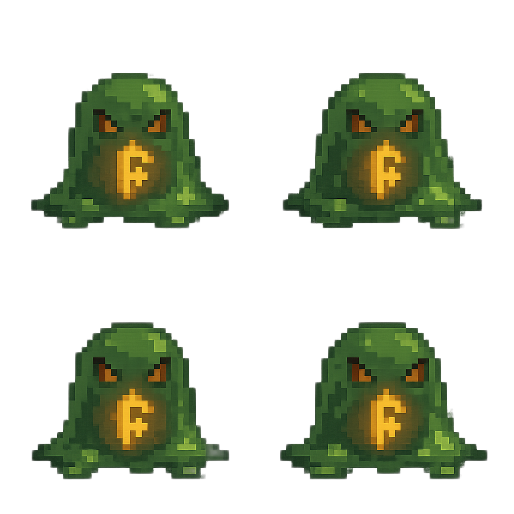

# Rune-Core Cave Slime

**Asset ID:** `enemy_slime_01_sprite`  
**Enemy Type:** `Slime`  
**Intended Use:** World enemy  
**Behavior:** Hop and pursue the player  
**Animation:** 4-frame idle cycle

**Implemented:** No  
**Implementation:** `Not mapped to runtime code`  
**Asset generated:** Yes  
**Asset:** assets/generated/enemies/slime_01/sprite/source.png  

## Asset Reference

| Field | Value |
|---|---|
| Source request | [request.json](../../assets/generated/enemies/slime_01/sprite/request.json) |
| Generated image | [source.png](../../assets/generated/enemies/slime_01/sprite/source.png) |
| Presentation tier | Pixel |
| Provider model | `gpt-image-1` |
| Processing status | Staging; pending approval |

The generated image is kept in the asset pipeline tree and referenced here for review. It is not copied into the documentation directory.

## Runtime Association

This asset is associated with `EnemyType::Slime`. Slime entities use the existing enemy pursuit and physics update path, while the renderer selects one of the four source quadrants from the sheet based on simulation time.
